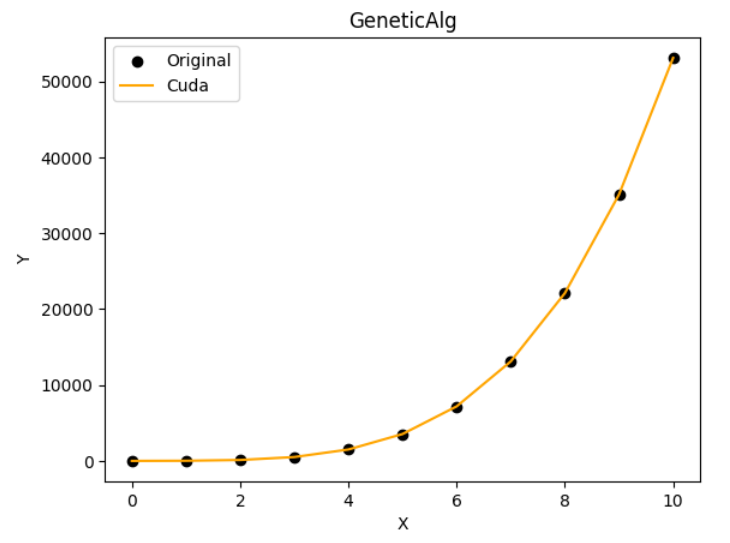

# Лабораторная работа 3
## Function Approximation by a Polynomial Using a Genetic Algorithm

Код реализует генетический алгоритм для аппроксимации полиномом. Были получены значения y с помощью CUDA на GPU.

## Результаты программы
| X   | Y    | Approximation Cuda Y|
|----------|-----------------|-------------------|
| 0 	   |4.000000|-1.359264|
| 1 	   |15.000000|18.702084|
| 2 	   |116.000000|120.422852|
| 3 	   |505.000000|506.792938 |
| 4 	   |1500.000000|1499.215698|
| 5 	   |3539.000000|3537.508301|
| 6 	   |7180.000000|7179.900391|
| 7 	   |13101.000000|13103.037109|
| 8 	   |22100.000000|22101.974609|
| 9 	   |35095.000000|35090.183594|
| 10 	   |53124.000000|53099.550781|

## График программы
