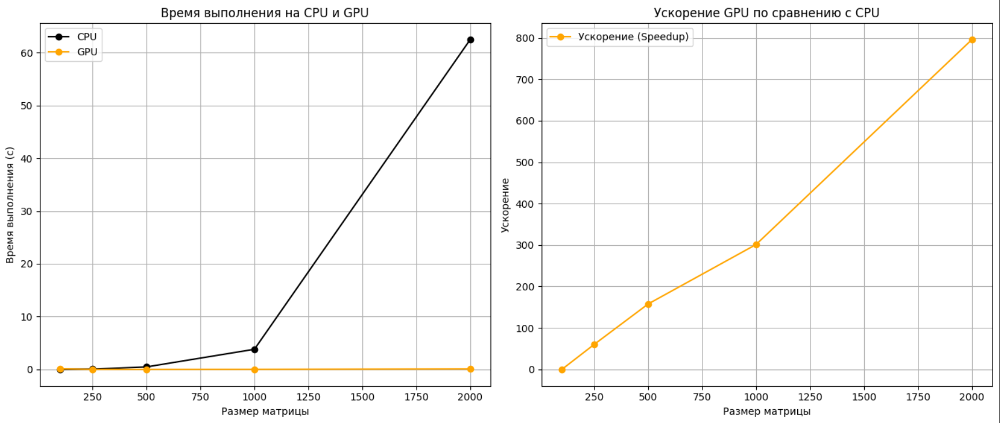

# Лабораторная работа 1 
## Перемножение матриц
Реализованы два подхода: последовательное умножение на CPU и параллельное умножение на GPU с использованием CUDA.
  
Для умножения матриц на CPU используется метод последовательного выполнения с тремя вложенными циклами Для ускорения вычислений на GPU был реализован CUDA-код в файле kernel.cu. Каждый поток отвечает за вычисление одного элемента результирующей матрицы.
  
Были перемножены матрицы разных размеров. Получены время работы функций на CPU и GPU. Посчитаны ускорения.

## Результаты программы
| Размер   | Время на CPU, с    | Время на GPU, с    |Ускорение          |
|----------|-----------------|-----------------|-------------------|
| 100 	   |0.002803 	     |0.103675 	       |0.02703641186399807|
| 250 	   |0.043189 	     |0.000715 	       |60.4041958041958   |
| 500 	   |0.466799 	     |0.002956 	       |157.91576454668473 |
| 1000 	   |3.807874 	     |0.012641 	       |301.23202278300766 |
| 2000 	   |62.446096        |0.078518 	       |795.3093048727679  |

## Графики программы

