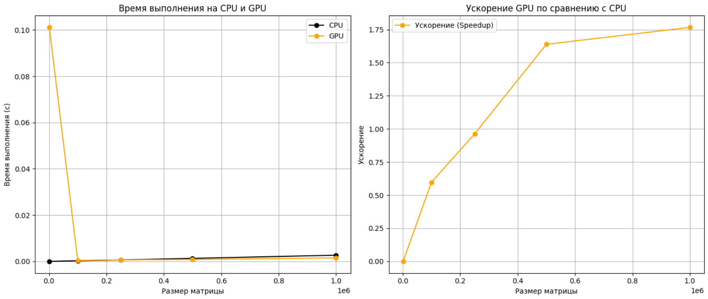

# Лабораторная работа 2 
## Сумма элементов вектора

В рамках GPU каждая нить обрабатывает один элемент вектора, и результат суммируется с использованием атомарной операции atomicAdd, чтобы избежать конфликтов записи. 
Были получены суммы элементов векторов разных размеров. Получены время работы функций на CPU и GPU. Посчитаны ускорения.

## Результаты программы
| Размер   | Время на CPU, с    | Время на GPU, с    |Ускорение          |
|----------|-----------------|-----------------|-------------------|
| 1000 	   |3e-06 	     |0.101142 	       |2.9661268315833188e-05|
| 100000 	   |0.000254 	     |0.000425 	       |0.5976470588235294   |
| 250000 	   |0.000637	     |0.000662 	       |0.9622356495468277 |
| 500000 	   |0.001288	     |0.000786  	       |1.638676844783715 |
| 1000000 	   |0.002664        |0.001508 	       |1.76657824933687  |

## Графики программы
